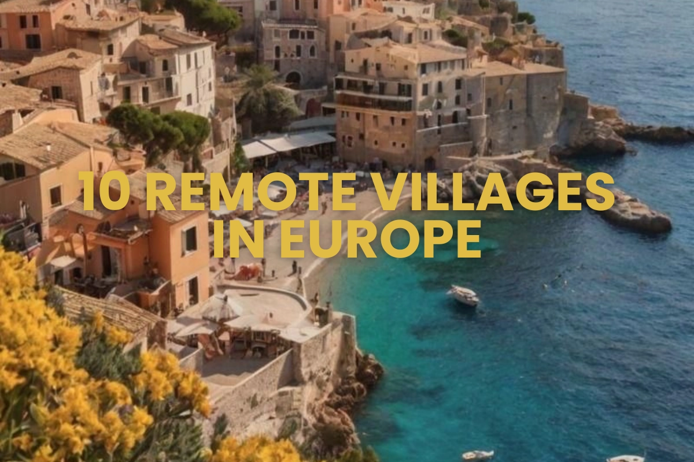

---

***En un mundo que se mueve rápido, cada vez más trabajadores remotos eligen moverse... _más lento_. Alejándose de las distracciones de las grandes ciudades, y buscando lugares tranquilos donde puedan respirar, crear y vivir con más intención.***

***Hace unos días compartimos una [publicación en LinkedIn](https://www.linkedin.com/posts/slow-working_workslowliveslower-activity-7353376588375244801-hp18?utm_source=share&utm_medium=member_desktop&rcm=ACoAABz5i4IBq5wKgfKS4wsoLrPnt-0xlT-0FuA) sobre cómo **el campo se está convirtiendo en la nueva frontera del trabajo remoto**. Generó conversación y confirmó lo que estamos viendo en toda Europa: cada vez más nómadas digitales están cambiando los rascacielos por valles, el concreto por adoquines y el ruido por claridad.***

***Esta lista es para quienes sienten ese llamado.***

***Ya sea que estés escribiendo un libro, lanzando un negocio remoto o simplemente buscando un estilo de vida más enraizado, estos 10 pueblos europeos ofrecen más que belleza: ofrecen equilibrio.***

---

## **1. Piódão, Portugal**

Un pueblo oculto de pizarra en las montañas de Serra do Açor, Piódão parece sacado de un cuento. Con casitas de piedra, senderos estrechos y un ritmo de vida intacto, es ideal para escritores, desarrolladores y creativos en busca de silencio profundo e inspiración. Sorprendentemente, el Wi-Fi es confiable para un lugar tan aislado, y los senderos cercanos son perfectos para desconectar de la pantalla.

 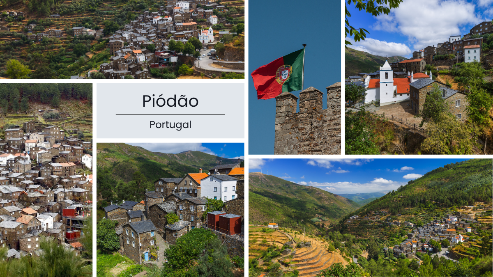 

---

## **2. Colletta di Castelbianco, Italia**

Este pueblo, antes abandonado, se ha transformado en un oasis de tecnología inteligente. Colletta di Castelbianco ofrece internet de fibra óptica en un entorno lleno de olivares y casas de piedra. Popular entre artistas y emprendedores, es una mezcla única de lo medieval y lo moderno, y prueba de que no necesitas sacrificar conexión por tranquilidad.

 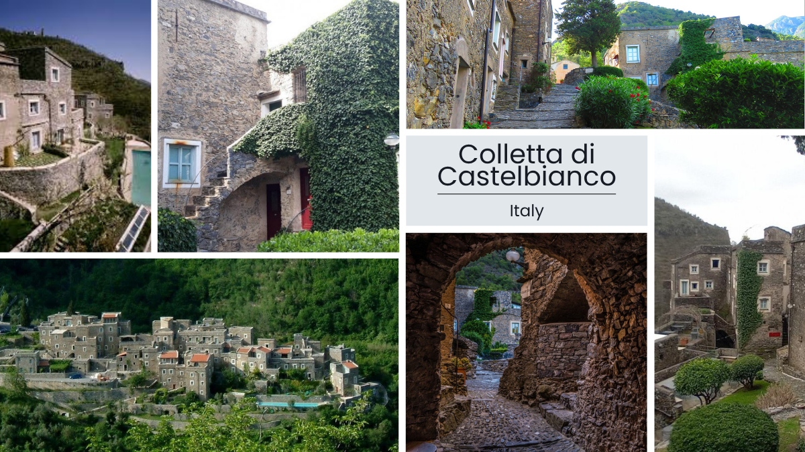 

---

## **3. Valldemossa, España**

En lo alto de las montañas Tramuntana en Mallorca, Valldemossa ofrece calles adoquinadas, cafés serenos y un modo de vida pausado. Con vistas impresionantes y una comunidad acogedora, este pueblo atrae a trabajadores remotos de todo el mundo. Ya sea editando videos, dirigiendo una startup o escribiendo en tu diario, su energía calma impulsa la productividad.

 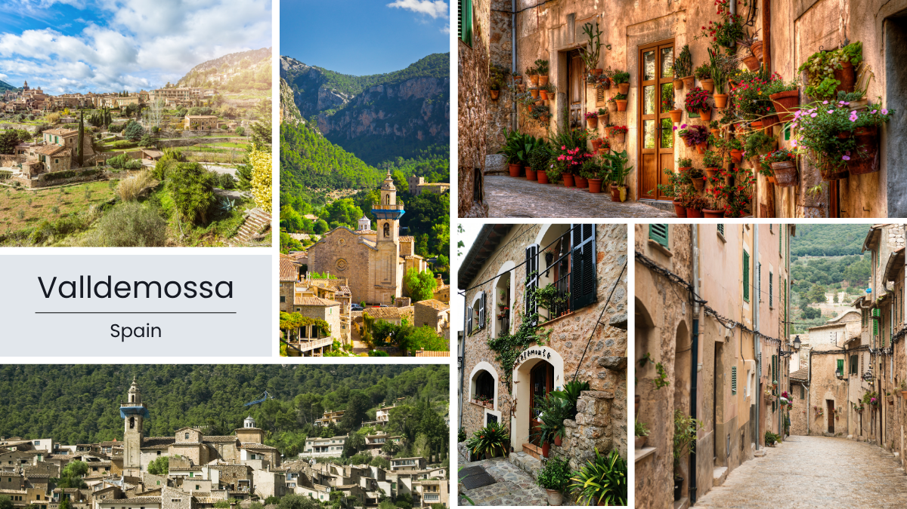 

---

## **4. Bansko, Bulgaria**

Una estrella en ascenso en el mundo nómada digital, Bansko combina vida montañesa con infraestructura moderna. Espacios de coworking, Wi-Fi rápido, alquiler asequible y un flujo constante de freelancers internacionales hacen de este pueblo alpino el lugar perfecto para construir comunidad mientras trabajas remoto. Los amantes del aire libre apreciarán la cercanía a pistas de esquí y senderos.

 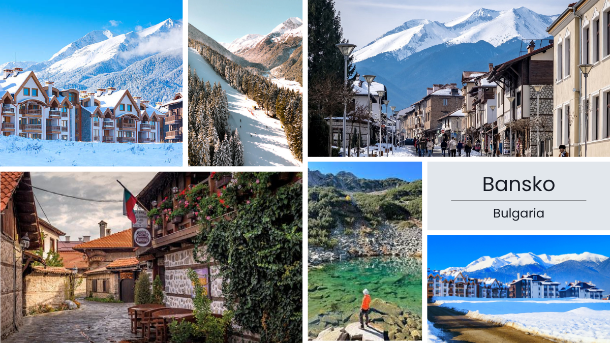 

---

## **5. Hallstatt, Austria**

Este sitio Patrimonio de la Humanidad por la UNESCO parece una postal hecha realidad. Con vistas al lago, casas color pastel y aire alpino fresco, Hallstatt es ideal para quienes buscan un espacio de trabajo pacífico y reflexivo. El ritmo lento de vida aquí es perfecto para pensadores profundos, diseñadores y creativos remotos.

 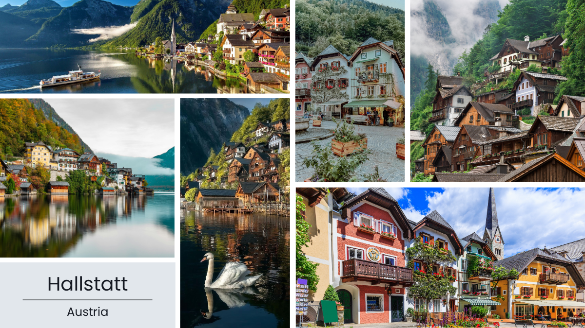 

---

## **6. Ronda, España**

Dramáticamente suspendida sobre un desfiladero en Andalucía, Ronda no solo es visualmente impresionante, sino también rica en cultura. El estilo de vida relajado, la comida local y el ritmo pausado la hacen ideal para quienes quieren desconectarse del ruido urbano. Con alojamientos acogedores y cafés con buen Wi-Fi, es un lugar excelente para trabajar mientras absorbes el encanto del sur de España.

 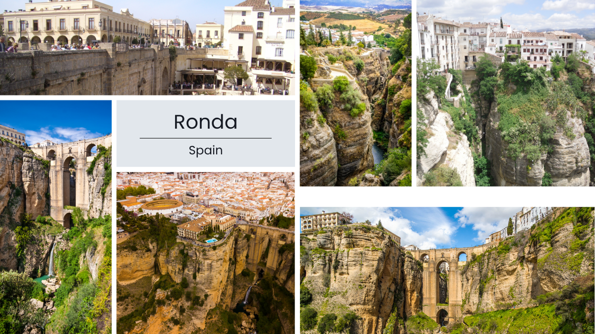 

---

## **7. Český Krumlov, Chequia**

En Český Krumlov el tiempo se detiene. Este pueblo de cuento ofrece callejones empedrados, encanto gótico y la paz que no encuentras en una ciudad. Los trabajadores remotos pueden aprovechar horas de trabajo tranquilas, paseos escénicos y un ambiente inspirador que naturalmente potencia la creatividad. Además, es amigable con los presupuestos para estancias largas.

 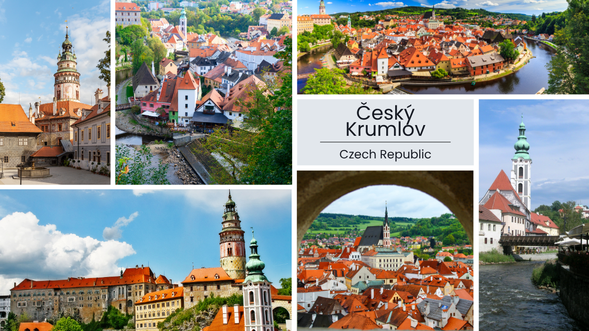 

---

## **8. Telč, Chequia**

Conocida por su arquitectura renacentista y casas de colores pastel, Telč invita a la simplicidad y al enfoque. Su encanto radica en su capacidad de hacerte bajar el ritmo y reconectar contigo mismo y tu trabajo. Las casas de huéspedes locales ofrecen Wi-Fi confiable y pocas distracciones, convirtiéndolo en una base perfecta para profesionales remotos que buscan tranquilidad.

 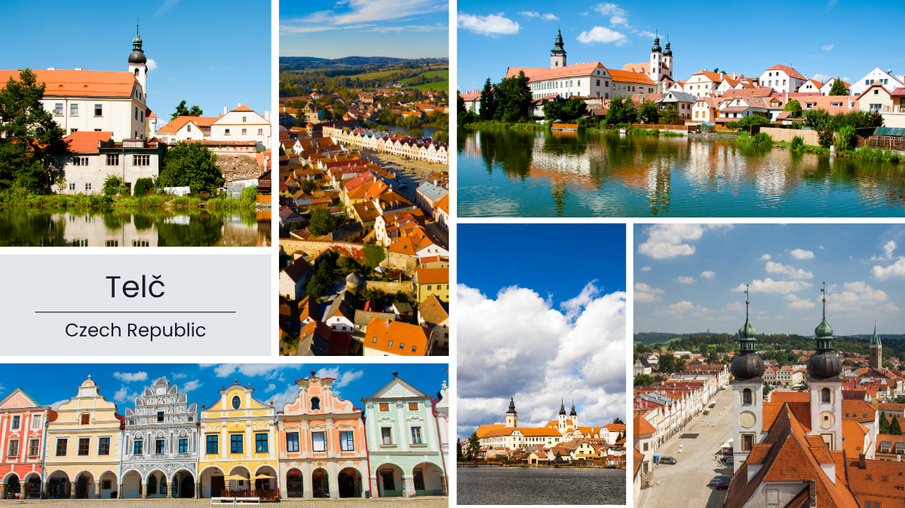 

---

## **9. Aljezur, Portugal**

Un paraíso surfista con un toque consciente. Aljezur ofrece costas escarpadas, densos bosques y una creciente escena de trabajo remoto eco-consciente. Muchos nómadas digitales vienen por las olas, pero se quedan por la comunidad. Ya sea que estés freelanceando, organizando talleres virtuales o lanzando un negocio sostenible, Aljezur apoya tanto el trabajo como el bienestar.

 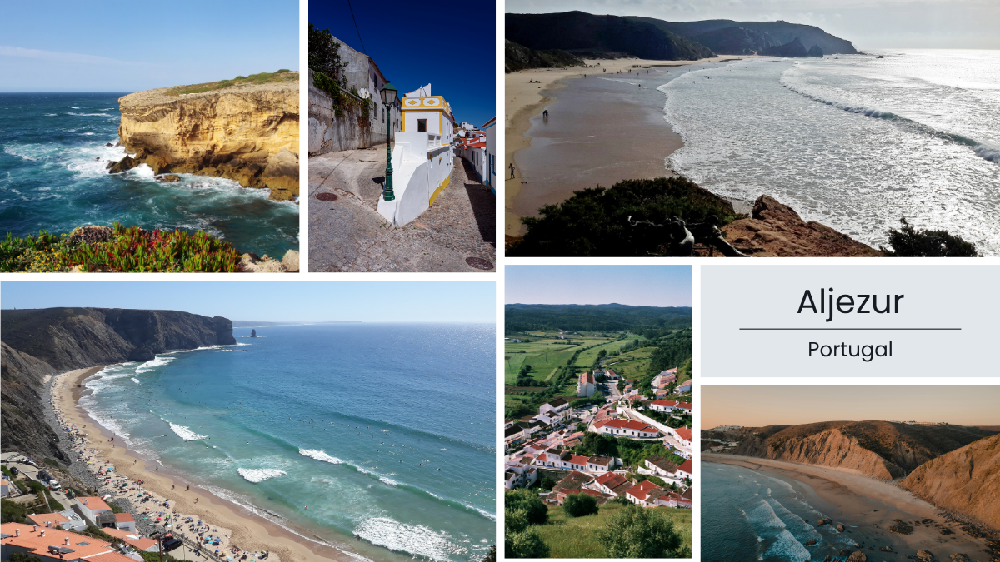 

---

## **10. Islas Lofoten, Noruega**

Remotas, dramáticas e increíblemente inspiradoras: las Islas Lofoten son para quienes prosperan en los extremos de la naturaleza. Piensa en cabañas de pescadores convertidas en espacios de trabajo, auroras boreales y largas horas de luz en verano. Aunque el acceso a internet es bueno en la mayoría de los centros, son la claridad y el silencio los que hacen de este archipiélago un sueño para creativos valientes y constructores enfocados.

 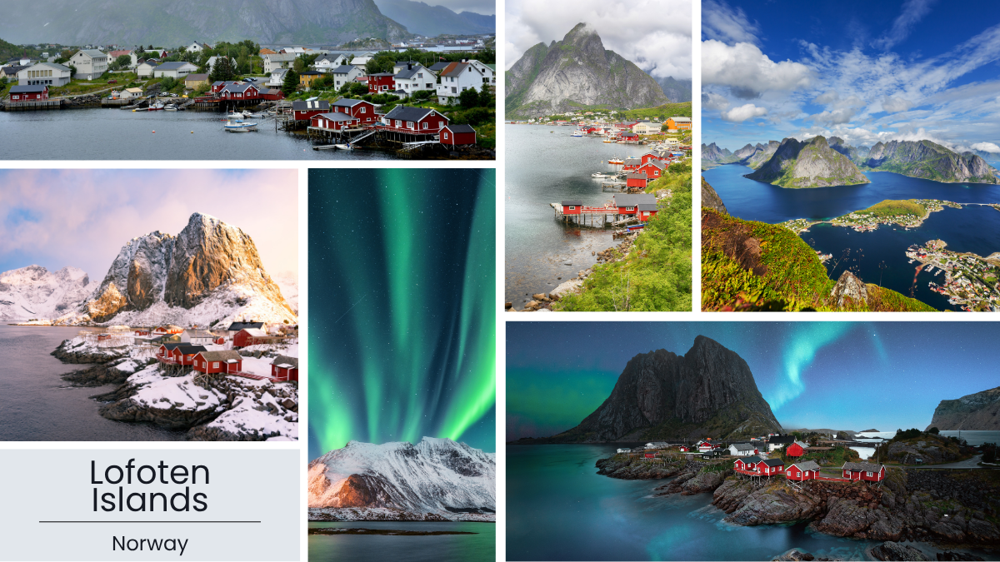 

---

## Cómo Slowork apoya tu vida slow

Ya sea que busques tu próxima base o construir conexiones significativas, Slowork hace que el estilo de vida remoto sea más fácil e intencional. A través de nuestra plataforma, los nómadas digitales pueden encontrar alojamientos eco-conscientes, conectar con profesionales locales y acceder a una red global de personas afines. No es solo un lugar para quedarse, es una forma de vivir, trabajar y crecer con propósito.

Diseña tu ritmo. Escapa del ruido. Únete a la lista de espera en [slowork.app](https://slowork.app) y sé el primero en experimentar un enfoque más humano al trabajo remoto.

---

## Reflexión final: por qué los pueblos pueden ser el futuro del trabajo remoto

Las grandes ciudades pueden ofrecer velocidad, pero los pueblos pequeños ofrecen algo mucho más valioso: espacio para respirar, pensar y vivir. Para los nómadas digitales en busca de sostenibilidad, equilibrio y significado, estos rincones de Europa están redefiniendo lo que significa trabajar con libertad.

Con las herramientas y mentalidad adecuadas (y con ayuda de plataformas como Slowork), puedes construir una vida remota no solo productiva, sino profundamente satisfactoria. Porque a veces, bajar el ritmo es la forma más inteligente de avanzar.